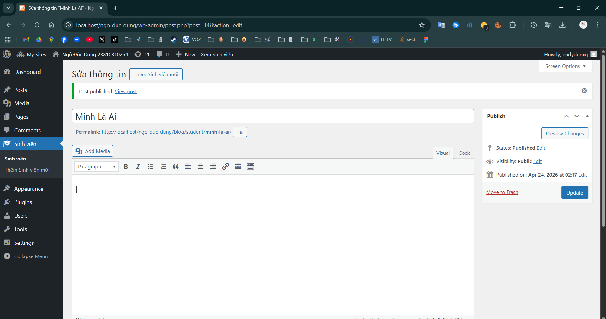
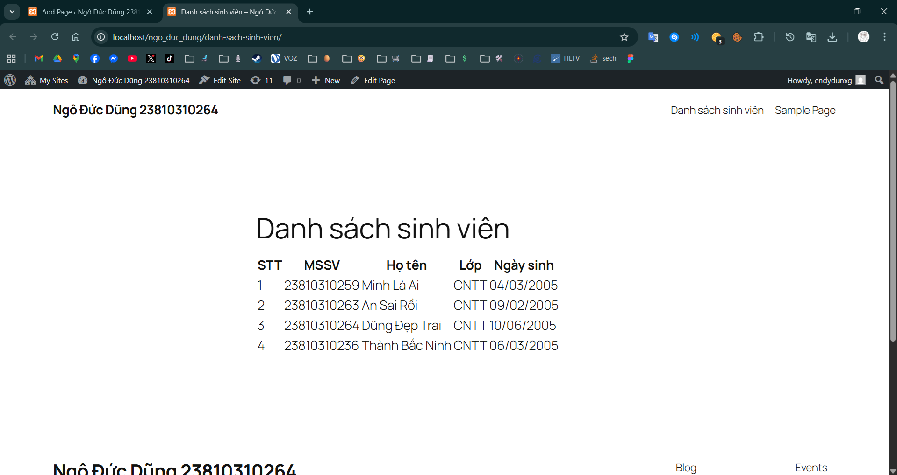

# Student Manager Plugin

Plugin quản lý sinh viên WordPress. 
**Tác giả:** Ngô Đức Dũng
**MSSV:** 23810310264

## Chức năng
- Custom Post Type quản lý sinh viên.
- Meta boxes lưu trữ MSSV, Lớp, Ngày sinh.
- Shortcode `[danh_sach_sinh_vien]` xuất dữ liệu ra bảng Frontend.

## Kết quả đạt được
### Giao diện Backend

### Giao diện Frontend
